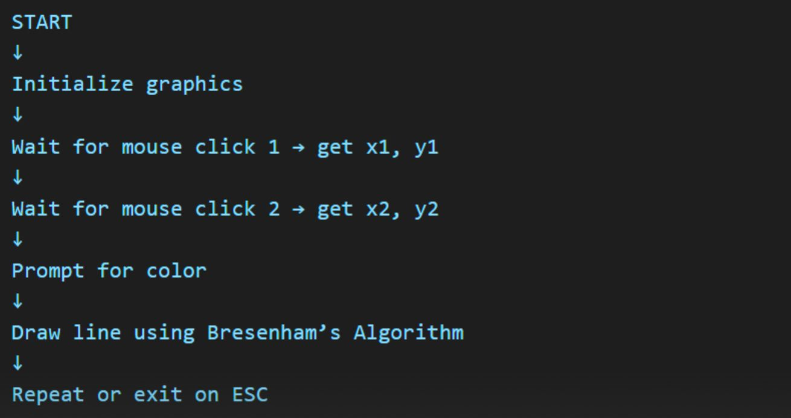
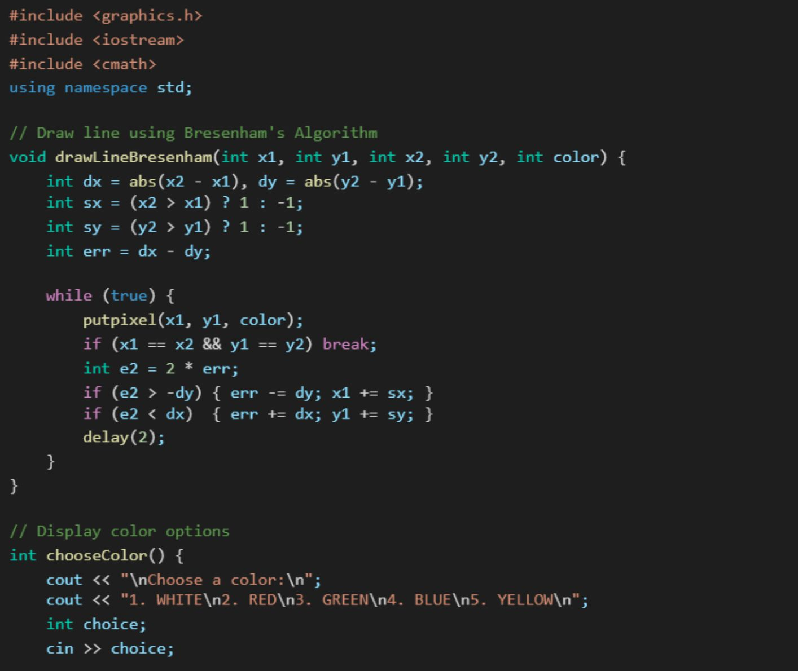
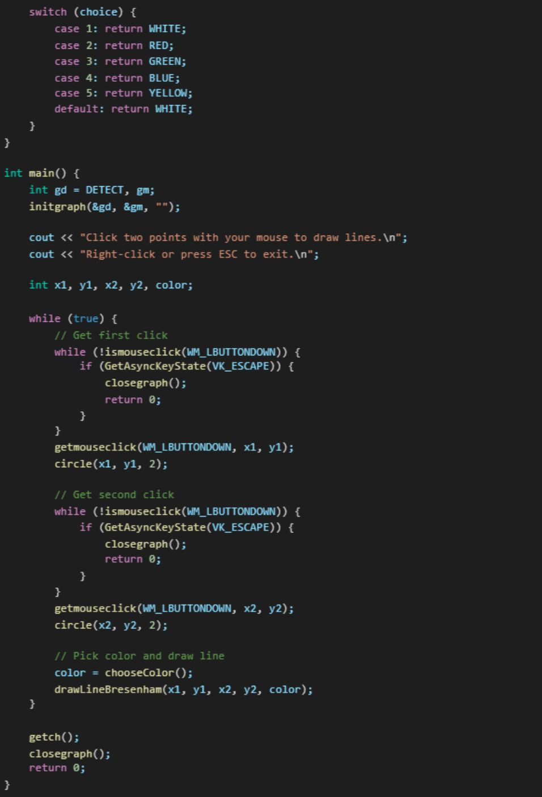

# Bresenham's Line Drawing Algorithm

## Overview

This project implements **Bresenham's Line Drawing Algorithm** in C++ using the **graphics.h** library. It is an interactive educational tool that allows users to draw lines using mouse clicks while visualizing the algorithm's pixel-by-pixel execution. The project was developed as part of the Computer Graphics course at Chandigarh University. 

---

## Features

- Interactive mouse-based line drawing
- Multiple color selection
- Real-time pixel rendering
- Bresenham's Line Drawing Algorithm implementation
- Lightweight educational graphics application

The report describes these features as the core functionality of the project. 

---

## Technologies Used

- C++
- graphics.h (WinBGIm)
- Code::Blocks IDE
- Computer Graphics

---

## Project Workflow

1. Initialize graphics mode.
2. Select the first point using the mouse.
3. Select the second point.
4. Choose a drawing color.
5. Draw the line using Bresenham's Algorithm.
6. Repeat until the user exits.

This workflow matches the implementation plan in the report. 

---

## Project Structure

## Project Structure

```text
Bresenham-Line-Drawing-Algorithm/
├── figures/
│   ├── flowchart.jpeg
│   ├── code-part1.jpeg
│   └── code-part2.jpeg
├── report/
│   └── Bresenham_Line_Drawing_Report.pdf
├── README.md
└── LICENSE
```
---

## Project Figures

### Algorithm Flowchart



### Bresenham Algorithm Implementation





## Results

The implementation successfully demonstrates Bresenham's Line Drawing Algorithm through an interactive interface with accurate pixel plotting and color selection. 

---

## Future Improvements

- DDA Line Drawing Algorithm
- Circle Drawing Algorithm
- Improved GUI
- Undo / Redo
- Save Canvas Feature

These enhancements are listed in the project's future work section. 

---

## Authors

- Sriporna Biswas
- Manmoy Khastagir
- Md. Mahdi Hasan

Developed as a Computer Graphics course project at Chandigarh University. 

---

## License

This project is released under the MIT License.
